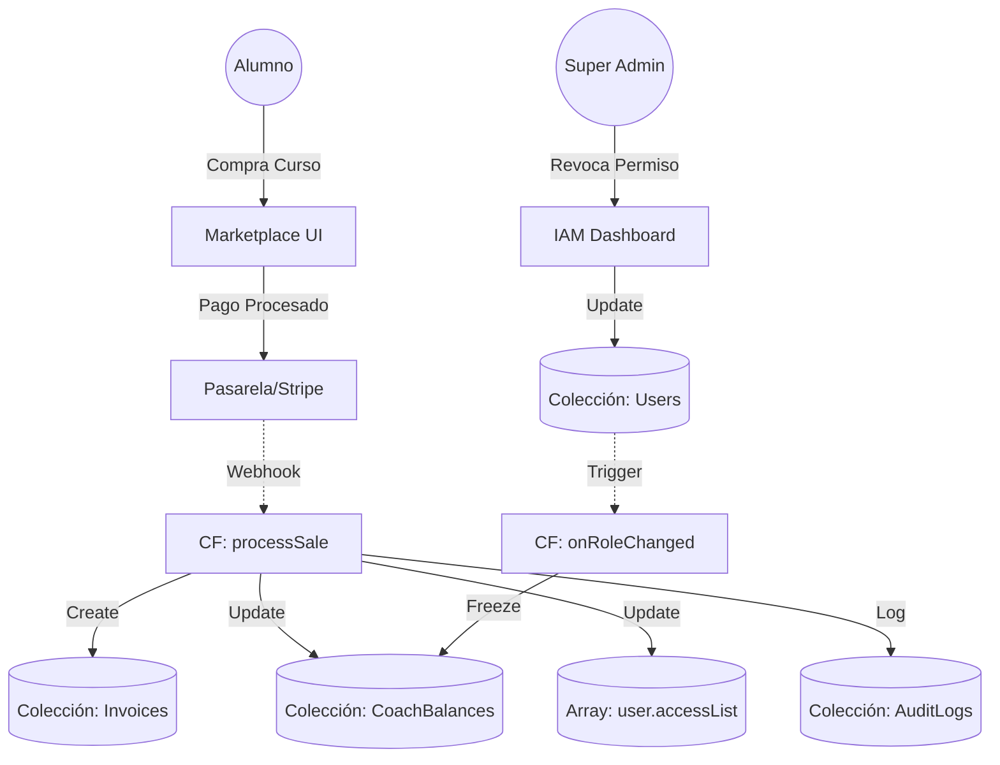

# Arquitectura del Sistema (Kira ERP & EdTech)

## 1. Principios de la Arquitectura
*   **Single Source of Truth (SSOT):** Toda entidad (Usuario, Contenido, Finanzas) reside en colecciones únicas, sin duplicidad innecesaria. Los datos derivados o calculados se manejan mediante *Cloud Functions* y se propagan como metadatos si es necesario.
*   **Event-Driven Design:** El sistema reacciona a eventos (ej. `onSaleCompleted`, `onPermissionRevoked`). Esto desacopla los módulos, mejora el rendimiento y facilita la escalabilidad.
*   **Seguridad de Confianza Cero (Zero Trust IAM):** Cada lectura y escritura es validada primero por Firestore Security Rules basándose en los `claims` y roles explícitos en el documento `users/{uid}`.

---

## 2. Diagrama de Flujo de Datos (Event-Driven)



---

## 3. Esquema de Base de Datos (Firestore NoSQL)

Al usar Firebase (Firestore), no usamos SQL estricto, sino una estructura orientada a documentos y sub-colecciones optimizada para lecturas.

### Módulo: `users` (Central IAM)
```typescript
interface User {
  uid: string;
  email: string;
  displayName: string;
  role: 'admin' | 'coach' | 'alumno' | 'hr';
  status: 'active' | 'frozen' | 'archived'; // Para congelar pagos/accesos
  
  // RBAC permissions (aplicables a coaches/admins)
  staffPermissions?: ('content' | 'billing' | 'users' | 'system' | 'course.create' | 'app.branding.edit')[];
  
  // Acceso de estudiantes
  accessList?: string[]; // IDs de productos/cursos a los que tiene acceso
  
  createdAt: Timestamp;
}
```

### Módulo: `marketplace` (Catálogo)
```typescript
interface Product {
  id: string; // SKU o ID del documento
  title: string;
  type: 'curso' | 'libro' | 'mentoria';
  price: number;
  status: 'draft' | 'published';
  authorId: string; // Referencia al Coach/Admin creador
  commissionRate: number; // Ej: 0.70 (70% para el coach)
}
```

### Módulo: `invoices` (Finanzas)
```typescript
interface Invoice {
  id: string;
  buyerId: string;
  productId: string;
  amount: number;
  status: 'paid' | 'pending' | 'failed';
  createdAt: Timestamp;
}
```

### Módulo: `coach_balances` (Liquidación)
```typescript
interface CoachBalance {
  coachId: string; // Document ID (== user.uid)
  available: number;
  pending: number;
  freezed: boolean; // Si es TRUE, no puede retirar fondos
  lastPayout: Timestamp;
}
```

---

## 4. Lógica de Funciones y Eventos (Node.js & Firebase Cloud Functions)

A continuación, la lógica de interconexión (Pseudocódigo TypeScript) usando Cloud Functions.

### A. Venta de un Producto (Marketplace -> Finanzas -> CMS Académico)

```typescript
export const processSale = functions.firestore
  .document('sales/{saleId}')
  .onCreate(async (snap, context) => {
    const saleData = snap.data();
    const db = admin.firestore();
    const batch = db.batch();

    // 1. Dar acceso al alumno (CMS Académico)
    const userRef = db.collection('users').doc(saleData.buyerId);
    batch.update(userRef, {
      accessList: admin.firestore.FieldValue.arrayUnion(saleData.productId)
    });

    // 2. Generar factura en Módulo Administrativo
    const invoiceRef = db.collection('invoices').doc();
    batch.set(invoiceRef, {
      buyerId: saleData.buyerId,
      productId: saleData.productId,
      amount: saleData.price,
      status: 'paid',
      createdAt: admin.firestore.FieldValue.serverTimestamp()
    });

    // 3. Calcular comisión en Centro de Liquidación para el Coach
    const productSnap = await db.collection('marketplace').doc(saleData.productId).get();
    const product = productSnap.data();
    
    if (product.authorId) {
      const balanceRef = db.collection('coach_balances').doc(product.authorId);
      const commission = saleData.price * product.commissionRate;
      
      // Incremento atómico del balance
      batch.set(balanceRef, {
        available: admin.firestore.FieldValue.increment(commission)
      }, { merge: true });
    }

    await batch.commit();
});
```

### B. Revocación de Accesos e Interconexión con Finanzas

Si se revoca "coach" o "billing" a un usuario, su cuenta de pagos se congela.

```typescript
export const onUserRoleChanged = functions.firestore
  .document('users/{userId}')
  .onUpdate(async (change, context) => {
    const before = change.before.data();
    const after = change.after.data();
    const userId = context.params.userId;
    const db = admin.firestore();

    // Comprobar si se ha removido un permiso crítico o se ha "congelado" la cuenta
    const wasFrozen = before.status === 'frozen';
    const isNowFrozen = after.status === 'frozen';
    
    const hadBillingPerm = before.staffPermissions?.includes('billing');
    const hasBillingPerm = after.staffPermissions?.includes('billing');

    let freezePayments = false;

    if (!wasFrozen && isNowFrozen) freezePayments = true;
    if (hadBillingPerm && !hasBillingPerm) freezePayments = true; // Si perdió permisos de facturación

    if (freezePayments) {
      // 1. Congelar pagos en Centro de Liquidación
      await db.collection('coach_balances').doc(userId).set({
        freezed: true,
        freezeReason: 'IAM Policy Revoked',
        freezedAt: admin.firestore.FieldValue.serverTimestamp()
      }, { merge: true });

      // 2. Registrar en Módulo de Auditoría (Audit Log)
      await db.collection('audit_logs').add({
        action: 'PAYMENT_FROZEN',
        targetId: userId,
        reason: 'IAM Permission modified automagically.',
        timestamp: admin.firestore.FieldValue.serverTimestamp()
      });
    }
});
```

---

## 5. Diseño Frontend: "Futurista, Lógico y Humano"

Para la **Interfaz de Usuario (UX/UI)** del IAM (Identity and Access Management) y Dashboard, utilizaremos el concepto de intercepción cognitiva y "pulse" tecnológico:

*   **Identidad Visual Orgánica/Sintética:**
    Sombras luminiscentes (cian/indigo) tipo *Neural Core*, cristales esmerilados (backdrop-blur) sobre fondos oscuros o pizarras claras (slate-900 u 800 para componentes sensibles como seguridad).
*   **Modularidad tipo "Mission Control":**
    El dashboard no es solo una página, es un panel interconectado (Omnibar ⌘K), con widgets reaccionando a los cambios en tiempo real.
*   **Acciones Destructivas Seguras:**
    Revocar accesos congelará estados e implicará un "Swipe to confirm" (deslizar para confirmar) o alertas con micro-animaciones (rojo/naranja de advertencia).
